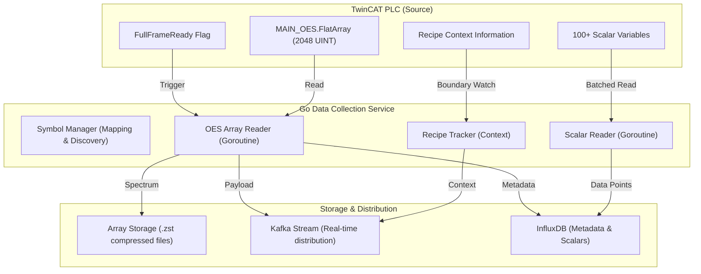

# System Architecture: TwinCAT OES Data Collection & Field Mapping

This document outlines the architecture and data flow for the high-performance OES spectral data collection system.

## Features

- **High-Frequency Array Reading**: Collects 2048-point spectra at full frame rate from TwinCAT PLCs using the ADS protocol.
- **Flag-Based Triggering**: Synchronizes with the PLC via the `FullFrameReady` flag to ensure no data loss or redundant reads.
- **Intelligent Field Mapping**: Dynamically maps source PLC paths to target application paths (e.g., `Recipe.Status` → `MAIN_1.recipeexecute.Status`).
- **Multi-Rate Collection**: Optimized reading of scalar variables (10ms for critical process data, 1s for recipe info).
- **Zstandard Compression**: Achieves ~10:1 compression for spectral data, significantly reducing storage costs.
- **Recipe Context Tracking**: Automatically associates every spectrum with its process job, substrate ID, and recipe step.
- **Hybrid Storage Strategy**: Local compressed file-based storage for high-volume spectra and InfluxDB for metadata querying.

## System Architecture

## Data Flow

1.  **Discovery**: On startup, the `SymbolManager` connects to the TwinCAT PLC via ADS, discovers all symbols, and applies the configured field mappings.
2.  **Collection**:
    -   The `OESArrayReader` polls the `FullFrameReady` flag every 1ms. When set, it reads the 2048-point array and resets the flag.
    -   The `ScalarReader` performs batched reads of scalar variables at configured frequencies (10ms, 100ms, etc.).
    -   The `RecipeTracker` monitors recipe start/end flags to maintain the current process context.
3.  **Processing**:
    -   Spectral data is stamped with a high-resolution timestamp and sequence number.
    -   Field mappings are applied to all incoming data points to normalize the schema.
4.  **Storage**:
    -   Raw intensities are compressed using Zstandard and appended to rotated `.zst` files.
    -   Metadata (sequence, acquisition counter, segment info) is stored in InfluxDB for fast historical retrieval.
    -   Processed data is published to Kafka for downstream real-time analysis modules.
