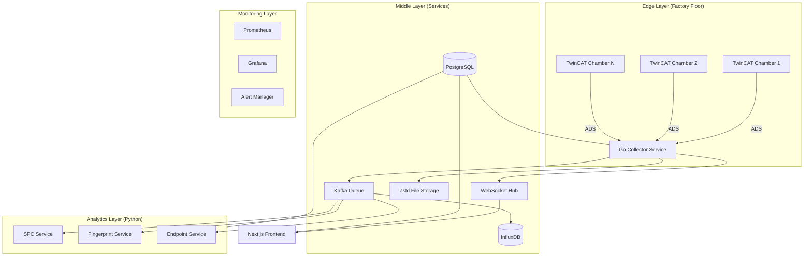

# Standardized PLC/OES Monitoring Platform Specification

This document serves as the master specification for the production-ready industrial monitoring platform for semiconductor etching processes.

## Executive Summary
A unified monitoring and control system for semiconductor etch tools that integrates real-time TwinCAT PLC data collection (100+ variables + 2048-point OES spectra), advanced endpoint detection, and predictive analytics into a high-scale, standardized solution.

---

## 1. System Architecture
The platform is organized into four logical layers for maximum scalability and reliability.

---

## 2. Technology Stack

### Backend Core (Go 1.22+)
- **Framework**: Fiber v3
- **Protocol**: go-ads (TwinCAT ADS)
- **ORM**: GORM (PostgreSQL/SQL Server)
- **Streaming**: Confluent Kafka Go

### Analytics Layer (Python 3.11)
- **Framework**: FastAPI
- **Libraries**: NumPy, SciPy, Pandas, scikit-learn
- **Algos**: SHAP (XAI), statsmodels (SPC), ruptures (Change Point)

### Frontend (Next.js 14)
- **UI**: Material-UI (MUI) v5
- **Viz**: Plotly.js (Scientific Plots), Three.js (3D Waterfall)
- **State**: Zustand

### Data & DevOps
- **Storage**: InfluxDB 2.x (Time-Series), PostgreSQL 15+ (Relational), Redis (Cache)
- **Deploy**: Docker / Kubernetes
- **Observability**: Prometheus + Grafana

---

## 3. Standardized Data Models

### PLC Data Point
| Field | Type | Description |
|---|---|---|
| `timestamp` | ISO8601 | High-res UTC timestamp |
| `wafer_id` | String | Unique identifier for the substrate |
| `data_type` | Enum | `scalar`, `array`, or `event` |
| `values` | Object | Key-value pairs of sensor data |

### OES Spectrum
| Field | Type | Description |
|---|---|---|
| `intensities` | Uint16[2048] | Raw ADC values from spectrometer |
| `wavelengths` | Float64[2048] | Calibrated pixel-to-wavelength mapping |
| `sequence_num` | Uint32 | Incrementing counter per run |

---

## 4. API & Integration Standards

### REST API (v1)
- `/api/v1/config/*`: Machine and recipe management.
- `/api/v1/data/*`: Retrieval of scalars, spectra, and timelines.
- `/api/v1/analytics/*`: Endpoint detection and SPC results.

### Webhooks & WebSockets
- **Live Updates**: Real-time scalar/spectrum streaming via WebSockets.
- **Alert Notifications**: Events pushed to target URLs (Slack, MES) via Webhooks.

---

## 5. Operational Standards

### Security
- **Auth**: JWT with refresh tokens; RBAC (Admin, Engineer, Tech).
- **Data**: Encryption at rest; TLS 1.3 in-transit.

### Performance (SLA)
- **Collection**: 10ms scalar / 1ms flag polling.
- **Latency**: <100ms from PLC sensor to UI visualization.
- **Storage**: 10:1 data compression for spectral arrays.

### Deployment
- **Environment**: Containerized via Docker.
- **Scaling**: 3+ replicas for core services in Kubernetes.
- **Monitoring**: 99.9% uptime target with Prometheus/Grafana alerting.

---

## 6. Success Criteria
1. Successfully deployed in 3+ pilot fabs.
2. 10ms collection from 100+ chambers concurrently.
3. Proven reduction in MTTR via Automated RCA.
4. Validated 10:1 compression ratio for long-term data retention.
